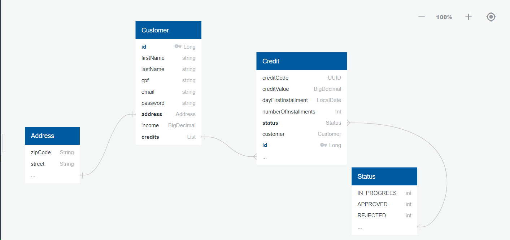

# API para Sistema de Avaliação de Créditos

Uma empresa de empréstimo precisa criar um sistema de análise de solicitação de crédito. Sua tarefa será
criar uma API Rest com Spring Boot e Kotlin, com as seguintes funcionalidades:

* ## Cliente (Customer):
  * ### Cadastrar:
    **a. Request:** firstName, lastName, cpf, income, email, password, zipCode e street
    
    **b. Response:** String
  * ### Editar cadastro:
    **a. Request:** id, firstName, lastName, income, zipCode, street
    
    **b. Response:** firstName, lastName, income, zipCode, email, zipCode, street
  * ### Visualizar perfil:
    **a. Request:** id
  
    **b. Response:** firstName, lastName, income, cpf, email, zipCode, street
  * ### Deletar cadastro:
    **a. Request:** id
  
    **b. Response:** sem retorno
* ## Soliticação de Empréstimo (Credit):
    * ### Cadastrar:
      **a. Request:** creditValue, dayFirstOfInstallment, numberOfInstallments, customerId

      **b. Response:** String
    * ### Listar todas as solicitações de empréstimo de um cliente:
      **a. Request:** customerId

      **b. Response:** creditCode, creditValue, numberOfInstallment
    * ### Visualizar um empréstimo:
      **a. Request:** customerId e creditCode

      **b. Response:** creditCode, creditValue, numberOfInstallment, status, emailCustomer, incomeCustomer

## Regras de Negócio
* O máximo de parcelas permitidas é 48
* Data da primeira parcela deverá ser no máximo 3 meses após o dia atual
